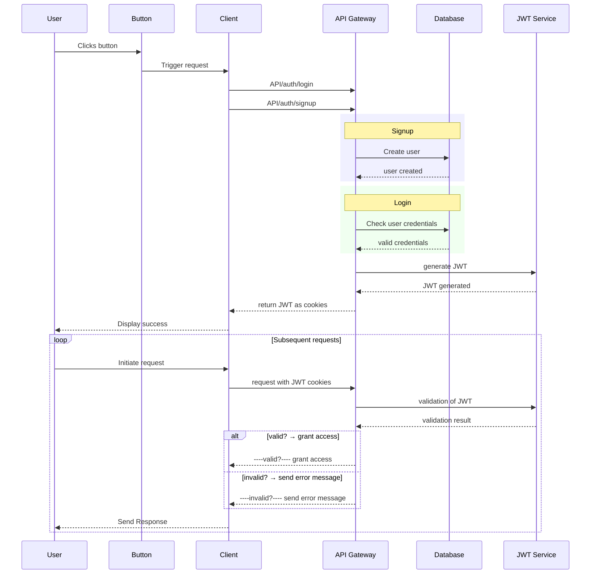

# 💬 Nexus — Real-Time Chat Application

A full-stack real-time chat application built with the **MERN stack** and **Socket.IO**, featuring JWT-based authentication, live online presence, image sharing via Cloudinary, and 32 switchable UI themes powered by DaisyUI.

---

## 🚀 Features

- 🔐 **Secure Authentication** — JWT stored in `HttpOnly` cookies, protected against XSS and CSRF
- ⚡ **Real-Time Messaging** — Bidirectional WebSocket communication via Socket.IO
- 🟢 **Online Presence** — Live online/offline indicators for all users
- 🖼️ **Image Sharing** — Send images in chat; profile pictures stored on Cloudinary CDN
- 🎨 **32 UI Themes** — Live theme switching powered by DaisyUI (persisted to `localStorage`)
- 👤 **Profile Management** — Upload and update your profile picture
- 🌐 **Production-Ready** — Frontend served as a static build from the Express server

---

## 🗂️ Project Structure

```
chatApp/
├── package.json                  # Root — build & start scripts for monorepo
│
├── backend/
│   ├── package.json
│   └── src/
│       ├── index.js              # Express app entry point, server bootstrap
│       ├── controllers/
│       │   ├── auth.controller.js      # signup, login, logout, updateProfile, checkAuth
│       │   └── message.controller.js   # getUsersForSidebar, getMessages, sendMessage
│       ├── models/
│       │   ├── user.model.js           # Mongoose schema: email, fullName, password, profilePic
│       │   └── message.model.js        # Mongoose schema: senderId, receiverId, text, image
│       ├── routes/
│       │   ├── auth.route.js           # POST /signup /login /logout, PUT /update-profile, GET /check
│       │   └── message.route.js        # GET /users, GET /:id, POST /send/:id
│       ├── miidleware/
│       │   └── auth.middleware.js      # protectRoute — JWT verification guard
│       ├── lib/
│       │   ├── db.js                   # MongoDB connection via Mongoose
│       │   ├── socket.js               # Socket.IO server + userSocketMap (online tracking)
│       │   ├── cloudinary.js           # Cloudinary SDK configuration
│       │   └── utils.js                # generateToken() — signs & sets JWT cookie
│       └── seeds/
│           └── user.seed.js            # Script to seed 16 demo users into the database
│
└── frontend/
    ├── index.html
    ├── vite.config.js
    ├── tailwind.config.js
    └── src/
        ├── main.jsx                    # React DOM entry point
        ├── App.jsx                     # Router, auth guard, theme wrapper
        ├── index.css
        ├── pages/
        │   ├── HomePage.jsx            # Main chat layout (Sidebar + ChatContainer)
        │   ├── LoginPage.jsx           # Login form
        │   ├── SignUpPage.jsx          # Registration form
        │   ├── ProfilePage.jsx         # View & update profile picture
        │   └── SettingsPage.jsx        # Live theme switcher (32 DaisyUI themes)
        ├── components/
        │   ├── Navbar.jsx              # Top nav with auth links and profile menu
        │   ├── Sidebar.jsx             # User list with online presence indicators
        │   ├── ChatContainer.jsx       # Message thread view
        │   ├── ChatHeader.jsx          # Selected user info + online badge
        │   ├── MessageInput.jsx        # Text & image message composer
        │   ├── NoChatSelected.jsx      # Empty state when no chat is open
        │   ├── AuthImagePattern.jsx    # Decorative pattern for auth pages
        │   └── skeletons/             # Loading skeleton components
        ├── store/
        │   ├── useAuthStore.js         # Zustand: auth state, socket lifecycle, online users
        │   ├── useChatStore.js         # Zustand: messages, selected user, socket subscriptions
        │   └── useThemeStore.js        # Zustand: active theme (persisted to localStorage)
        ├── lib/
        │   ├── axios.js               # Axios instance with baseURL & credentials config
        │   └── utils.js               # Utility helpers (e.g. date formatting)
        └── constants/
            └── index.js               # THEMES array — 32 DaisyUI theme names
```

---

## 🔄 Data Flow Diagram


>>>>>>> 49c2470 (Readme refined)

---

## 🛠️ Tech Stack

<<<<<<< HEAD
### Frontend
- React.js
- Tailwind CSS
- Axios
- Zustand (or Redux if used)

### Backend
- Node.js
- Express
- MongoDB (Mongoose)
- Socket.io
- Cloudinary (for image uploads)
- dotenv

---

## 🖼️ Project Structure

Nexus-chatApplication/
├── backend/
│   ├── controllers/
│   ├── models/
│   ├── routes/
│   ├── middleware/
│   ├── utils/
│   └── .env
├── frontend/
│   ├── src/
│   ├── public/
│   └── .env
├── .gitignore
├── README.md
└── package.json


⚙️ Installation
```bash
git clone https://github.com/yourusername/nexus-chat-app.git
cd nexus-chat-app
npm install
npm run dev
=======
### Backend
| Technology | Role |
|---|---|
| **Node.js + Express** | REST API server |
| **MongoDB + Mongoose** | Database & ODM |
| **Socket.IO** | WebSocket server for real-time events |
| **JWT (jsonwebtoken)** | Stateless auth tokens |
| **bcryptjs** | Password hashing (salt rounds: 10) |
| **Cloudinary** | CDN for profile pics & chat images |
| **cookie-parser** | Read `HttpOnly` JWT cookies |
| **dotenv** | Environment variable management |
| **nodemon** | Dev auto-reload |

### Frontend
| Technology | Role |
|---|---|
| **React 19 + Vite** | UI framework & build tool |
| **Zustand** | Lightweight global state management |
| **Socket.IO Client** | WebSocket client |
| **Axios** | HTTP client with credentials |
| **React Router v7** | Client-side routing |
| **TailwindCSS + DaisyUI** | Styling & 32 switchable themes |
| **Lucide React** | Icon library |
| **React Hot Toast** | Toast notifications |

---

## ⚙️ Architecture Overview

### Authentication Flow
1. User signs up or logs in → credentials sent to `POST /api/auth/signup` or `/login`
2. Backend hashes the password with `bcryptjs`, creates a `User` document
3. `generateToken()` signs a JWT (7-day expiry) and sets it as an `HttpOnly` cookie
4. Every subsequent request that requires auth passes through `protectRoute` middleware, which verifies the cookie JWT and attaches `req.user`
5. On app load, `useAuthStore.checkAuth()` hits `GET /api/auth/check` to restore session

### Real-Time Messaging Flow
1. On successful auth, the frontend connects a `socket.io-client` socket, passing `userId` as a query param
2. The backend's `socket.js` maps `userId → socketId` in `userSocketMap` (in-memory)
3. `io.emit("getOnlineUsers", [...])` broadcasts the updated online user list to all clients whenever someone connects or disconnects
4. When a message is sent (`POST /api/messages/send/:id`):
   - The message is saved to MongoDB
   - If the receiver is online, `io.to(receiverSocketId).emit("newMessage", message)` delivers it instantly
5. The frontend's `useChatStore.subscribeToMessages()` listens on the `"newMessage"` socket event and appends the message to local state in real time

### State Management (Zustand Stores)
| Store | Responsibility |
|---|---|
| `useAuthStore` | `authUser`, socket instance, `onlineUsers`, all auth actions |
| `useChatStore` | `messages`, `users` list, `selectedUser`, socket subscriptions |
| `useThemeStore` | Active DaisyUI theme, persisted to `localStorage` |

### API Endpoints

#### Auth — `/api/auth`
| Method | Path | Guard | Description |
|---|---|---|---|
| `POST` | `/signup` | — | Register a new user |
| `POST` | `/login` | — | Login and receive JWT cookie |
| `POST` | `/logout` | — | Clear JWT cookie |
| `PUT` | `/update-profile` | `protectRoute` | Upload new profile picture to Cloudinary |
| `GET` | `/check` | `protectRoute` | Verify session and return current user |

#### Messages — `/api/messages`
| Method | Path | Guard | Description |
|---|---|---|---|
| `GET` | `/users` | `protectRoute` | Get all users (excluding self) for the sidebar |
| `GET` | `/:id` | `protectRoute` | Get full message history with a specific user |
| `POST` | `/send/:id` | `protectRoute` | Send a text or image message to a user |

### Database Schemas

**User**
```
_id, email (unique), fullName, password (hashed), profilePic (Cloudinary URL), createdAt, updatedAt
```

**Message**
```
_id, senderId (ref: User), receiverId (ref: User), text?, image? (Cloudinary URL), createdAt, updatedAt
```

---

## 🔧 Local Development Setup

### Prerequisites
- Node.js ≥ 18
- MongoDB Atlas account (or local MongoDB)
- Cloudinary account

### 1. Clone the repository
```bash
git clone <your-repo-url>
cd chatApp
```

### 2. Configure backend environment
Create `backend/.env`:
```env
PORT=5001
MONGODB_URI=your_mongodb_connection_string
JWT_SECRET=your_jwt_secret_key

CLOUDINARY_CLOUD_NAME=your_cloud_name
CLOUDINARY_API_KEY=your_api_key
CLOUDINARY_API_SECRET=your_api_secret

NODE_ENV=development
```

### 3. Install dependencies
```bash
# Install backend dependencies
cd backend && npm install

# Install frontend dependencies
cd ../frontend && npm install
```

### 4. Run the development servers

In **terminal 1** (backend):
```bash
cd backend
npm run dev        # nodemon src/index.js → http://localhost:5001
```

In **terminal 2** (frontend):
```bash
cd frontend
npm run dev        # Vite dev server → http://localhost:5173
```

### 5. (Optional) Seed the database with demo users
```bash
cd backend
node src/seeds/user.seed.js
```
This inserts 16 pre-built demo users. All have the password `123456`.

---

## 🏗️ Production Build

```bash
# From the root directory
npm run build    # installs deps + builds frontend dist/
npm start        # serves frontend from Express at PORT
```

In production, Express serves the frontend's `dist/` as static files — no separate frontend server needed.

---

## 🔒 Security Highlights

- Passwords hashed with `bcryptjs` (10 salt rounds) — plain text is never stored
- JWT set as `HttpOnly` + `SameSite: strict` cookie — inaccessible to JavaScript, resistant to XSS and CSRF
- `secure` flag enabled in production (HTTPS only)
- `protectRoute` middleware validates JWT on every protected endpoint before any business logic runs
- Payload size limited to **10 MB** to prevent large-file abuse (`express.json` limit)

---

## 🎨 Theming

Nexus supports **32 DaisyUI themes** selectable from the Settings page. The chosen theme is stored in `localStorage` under the key `chat-theme` so it persists across sessions. The default theme is `coffee`.
>>>>>>> 49c2470 (Readme refined)
